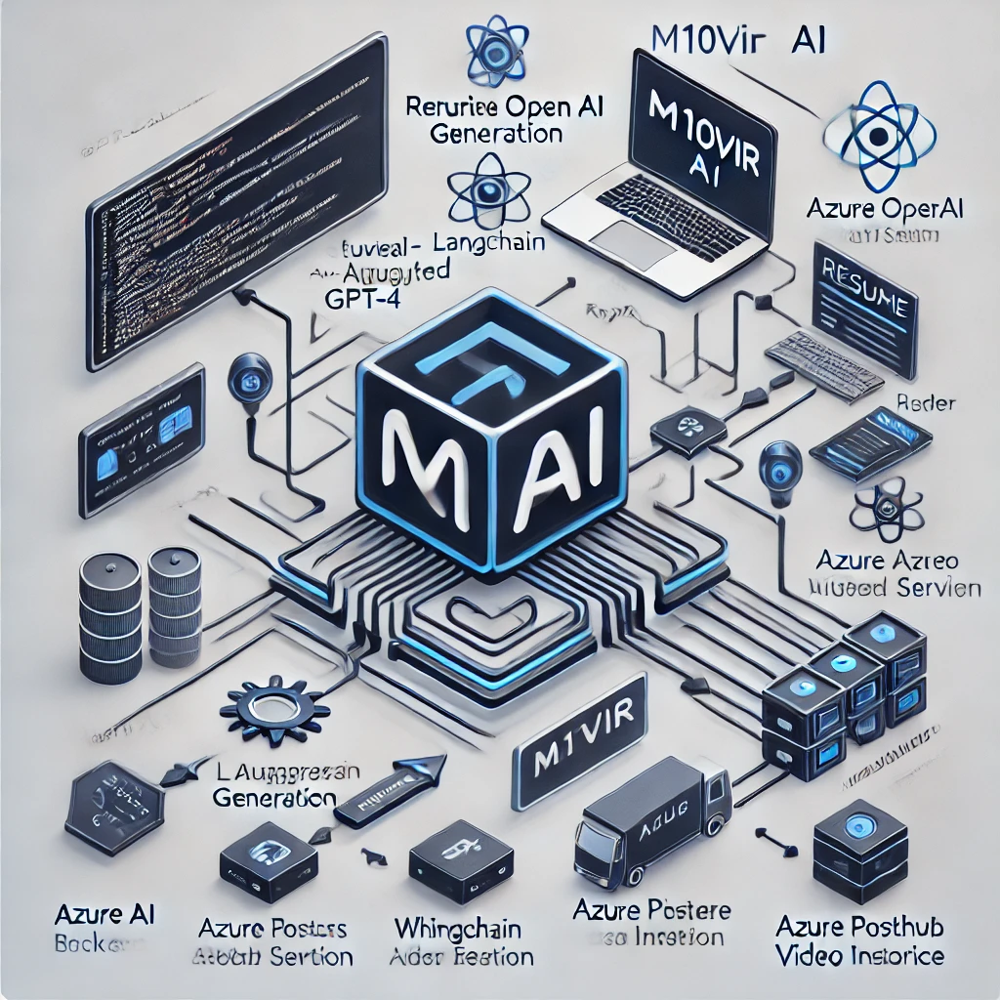

# 🤖 AI-Powered Resume & Interview Coach  
**LLM + RAG + Video Analysis | Built with Azure OpenAI, LangChain, Whisper, FastAPI, React, and Azure DevOps**

## 🎯 Project Overview

This project empowers job seekers with AI-driven resume analysis, tailored feedback using GPT-4, and AI-based video interview simulations. It uses modern AI techniques such as Retrieval Augmented Generation (RAG), Whisper for transcription, and responsible AI practices like SHAP for explainability.

---

## 🧠 Key Features

- 📄 **Resume Analysis** using GPT-4
- 🔍 **Job Description Matching** with semantic search (FAISS / Azure Cognitive Search)
- 🤖 **LLM Feedback Generation** using RAG
- 🎥 **Mock Interview Simulation** with voice/video input
- 🧠 **Speech-to-Text Transcription** using OpenAI Whisper
- 📊 **AI Feedback Analysis** on content, tone, emotion
- 🔐 **Responsible AI** with SHAP explainability
- 🚀 **End-to-End MLOps Pipeline** with Azure DevOps and GitHub Actions

---

## 🖼️ Architecture



---

## 🧰 Tech Stack

| Layer        | Technology |
|--------------|------------|
| 💡 LLM        | Azure OpenAI GPT-4 |
| 📦 RAG        | LangChain / Semantic Kernel |
| 🔎 Vector DB  | FAISS / Azure Cognitive Search |
| 🎥 Video AI   | Whisper + Azure Video Indexer |
| 🌐 Backend    | FastAPI |
| 🖥️ Frontend   | React.js |
| 🧪 Database    | Azure PostgreSQL |
| ⚙️ DevOps     | GitHub Actions + Azure Pipelines |
| 🧠 Explainability | SHAP / LIME |

---

## 📂 Project Structure

```bash
ai-resume-coach/
├── backend/
├── frontend/
├── ai/
├── infra/
├── notebooks/
├── .github/
├── README.md
└── architecture-diagram.png
